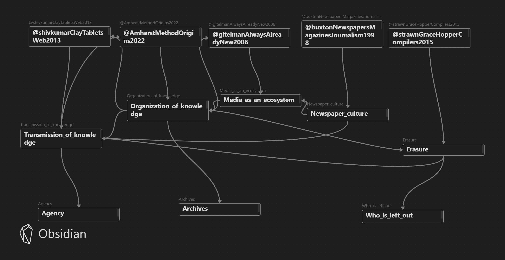

# Max's Memex

**What even is the internet? If you don't know, then you're at the right place, because neither do I! But let's try to learn about it little bits by bits...**

*Hopefully I don't break your mind, but here is how the memex is mapped so far:*

---
## Sources

#### Part 1:

- [[@AmherstMethodOrigins2022]]
- [[@buxtonNewspapersMagazinesJournalism1998]]
- [[@gitelmanAlwaysAlreadyNew2006]]
- [[@shivkumarClayTabletsWeb2013]]
- [[@strawnGraceHopperCompilers2015]]

#### Part 2:

- [[@standageVictorianInternet1999]]
- [[@johntullyVictorianEcologicalDisaster2009]]
- [[@macDougallPeopleNetwork2013]]
- [[@mullerCablingAtlanticWiring2016]]

---
## Atomic Notes

#### Part 1:

- [[Erasure]]
- [[Media_as_an_ecosystem]]
- [[Newspaper_culture]]
- [[Organization_of_knowledge]]
- [[Transmission_of_knowledge]]

#### Part 2:

- [[Competences]]
- [[Imperialist_internet]]
- [[Imperial_needs]]
- [[Visibility_of_speech]]
- [[Globalization_of_communication]]

## Ideas

#### Part 1:

- [[Agency]]
- [[Who_is_left_out]]
- [[Archives]]

#### Part 2:

- [[Technological_stagnation]]
- [[Control]]

---
## Feedback from Memex 1

- Greater emphasis on linking readings to the course and contradictions
- Identified recurring themes and ideas from readings

## To do 

- Continue expanding the visual mapping of the memex.
- Continue expanding my sources and enrich my perspective on the internet.
- Continue to interlink with other people's memex

---