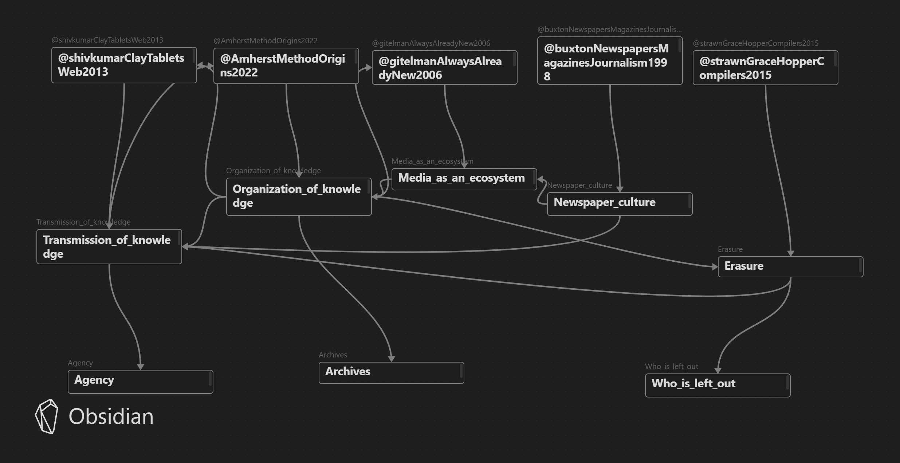

# Max's Memex

##### What even is the internet? If you don't know, then you're at the right place, because neither do I! But let's try to learn about it little bits by bits...

Hopefully I don't break your mind, but here is how the memex is mapped so far:

---
## Sources

- [[@AmherstMethodOrigins2022]]
- [[@buxtonNewspapersMagazinesJournalism1998]]
- [[@gitelmanAlwaysAlreadyNew2006]]
- [[@shivkumarClayTabletsWeb2013]]
- [[@strawnGraceHopperCompilers2015]]

---
## Atomic Notes

- [[Erasure]]
- [[Media_as_an_ecosystem]]
- [[Newspaper_culture]]
- [[Organization_of_knowledge]]
- [[Transmission_of_knowledge]]

## Ideas

- [[Agency]]
- [[Who_is_left_out]]
- [[Archives]]

---
## To do 

- Figure out how to effectively include annotation with atomic notes instead of just summarizing and using the quotes.
- Expand the visual mapping of the memex.
- Expand sources and enrich perspective on the internet.

---