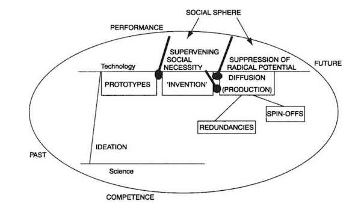

tags:: Memex2, competences, social necessity, emergence, telegraph, technology

- The framework of performances and competences helps us analyze how and why things come together the way they do. The framework below dictates how a series of conditions need to be met before something can emerge. Although there might be a social necessity for a new technology, if there are no competences in society, it cannot be created. As such, technology first needs to catch up, and only then can there be an emergence. For example, in the context of the transatlantic telegraph, it was the existence of different technologies that allowed people to lay down a cable. Manufacturing the cable was not too difficult, but it was the presence of large steamboats that allowed these cables to be laid in the ocean in the first place. In this case, with steamboats and cable manufacturers as competences, and the need to connect the world as a social necessity, the transatlantic telegraph emerged. 

---
### Citational Information

[[@standageVictorianInternet1999]]

---

### Related Links

Social necessities spells the need of new technology, but it's always competence that dictates whether it can happen such as the need for classification: [[@AmherstMethodOrigins2022]]

What happens when there is an abundance of competences, but a lack of social neccessity? [[Technological_stagnation]]